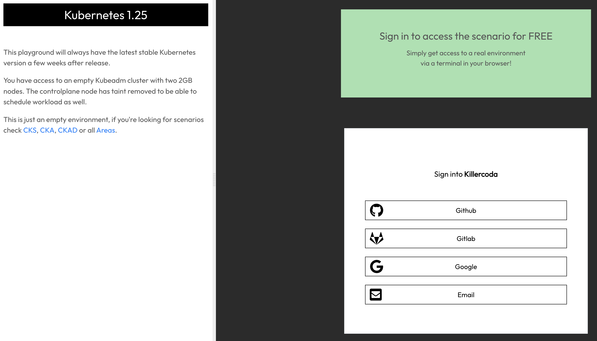

# k8s-intro

Este repositorio contiene una pequeña introducción a Kubernetes. Incluye algunos ejercicios prácticos para facilitar el entendimiento de los diferentes objetos que se pueden desplegar en el cluster, así como una forma fácil y práctica de usar un Playground. Lo único que necesitas es un computador con navegador web, conexión a internet y muchas ganas de aprender.

## Acceder a un Playground de Kubernetes

Killercoda ofrece un [playground de Kubernetes](https://killercoda.com/playgrounds/scenario/kubernetes) que se puede usar de forma gratuita, la unica restricción es que tiene un límite de uso de una hora, después de ello, el ambiente se reinicia.

Ingresa al playground y haz login con alguna de las opciones disponibles:

